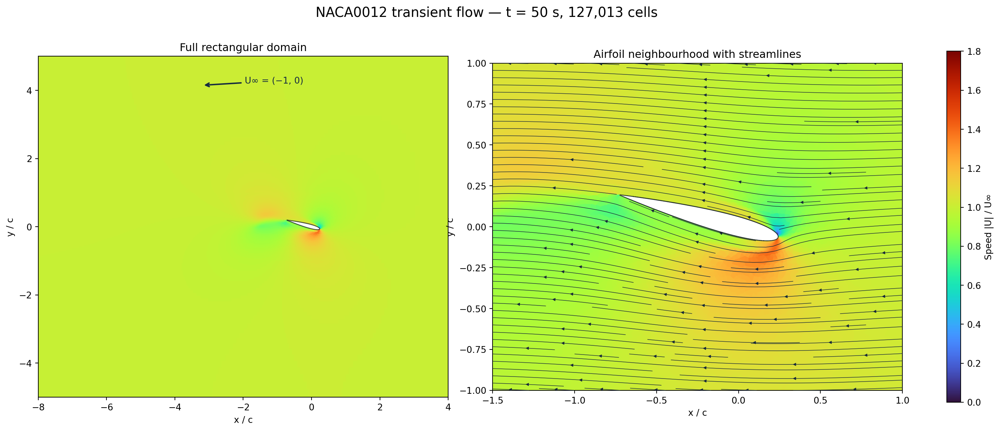

# NACA0012：15°、右向左来流、二维瞬态 PISO / kOmega

这是重新构建的算例。网格、边界条件和生成器均位于本目录；不依赖旧的
`generate_naca0012_ogrid.py`。网格已生成并通过 Python 与 BabelSim 原生读取器两套质量检查。
**此前已有 `deltaT=0.5 s`、`t=50 s` 的 100 步瞬态记录；这些结果来自旧 Eigen 数值后端，
尚未在当前 PETSc 后端复现。** 动量、k、ω 对流均采用一阶迎风。
原始失败记录与根因对照见 `validation/`；网格质量、短算可运行性和湍流模型物理精度是不同证据层次。

## 几何、方向和计算域

- 弦长 `c=1 m`，参考速度 `U∞=1 m/s`，来流 `(-1,0,0)`。
- 翼型前缘朝右，绕四分之一弦点旋转；前缘至尾缘的弦向角为全局 `165°`，
  来流角为 `180°`，两者相差 `15°`。四分之一弦点在原点。
- 矩形计算域 `x/c=[-8,4]`、`y/c=[-5,5]`。前缘到入口约 `3.76c`，
  尾缘到出口约 `7.28c`。这是适中域初始设置，正式升阻力对比仍需扩大域验证边界影响。
- 采用标准 NACA0012 厚度公式的有限厚度尾缘版本（四次项系数 `-0.1015`），
  在最后 `0.0015c` 内用平滑曲线封口，端点仍在 `x_local=1`。
  **它是带微小圆滑尾缘的 NACA0012 近似，不能称为精确复现某个实验尾缘。**
  这种封口避免尖角处法向层退化；与实验比较时必须计入尾缘几何差异。
- 沿 `z` 挤出一层 `0.02c` 厚度，前后均设 symmetry。这是三维有限体积网格上的
  二维约束流动，不包含三维失速机制。

## 网格

Python 显式生成翼面法向四边形层和笛卡尔背景，Triangle 只负责二者间的约束
Delaunay 连接。质量良好的三角形对合并成凸四边形，其余保留；随后统一挤出。
最终文件采用显式面连接的 `BABELSIM_MESH 3` 非结构格式，界面共节点、无悬挂面。

| 项目 | 实际值 |
|---|---:|
| 总单元 | 127,013 |
| 六面体 | 121,567 / 95.712% |
| 三棱柱 | 5,446 / 4.288% |
| 正交笛卡尔背景单元 | 81,920 / 64.50% |
| 翼面周向单元 | 744 |
| 全六面体近壁层 | 48 层 / 35,712 单元 |
| 第一层完整高度 | `3e-5 c` |
| 法向增长率 | 1.12 |
| 法向层总厚度 | `0.05735 c` |
| 实测第一层中心壁距 | `1.50000e-5`～`1.50679e-5 c` |
| 最大 / P95 内部面非正交角 | `38.079° / 3.368°` |
| 近壁层内部最大非正交角 | `2.367°` |
| 背景区内部最大非正交角 | `0°` |
| 最大归一化面偏斜 | `0.48763` |
| 最小平面内角 | `24.835°` |
| 近壁层最小平面内角 | `85.318°` |
| 最大平面边长比 | `142.14`，主要来自刻意设置的薄壁面层 |
| 非正体积 / 凹单元 / 非流形边 | 0 / 0 / 0 |
| 原生读取器最大单元面积向量闭合误差 | `1.46e-16` |

非正交角按体积中心连线与面法向计算；偏斜按面心到中心连线与面平面交点的
距离除以中心间距计算。指标不是“面心到中心连线中点”的误差。
拓扑检查会拒绝不匹配的内界面、漏标的外边界和非流形边。
网格预览为 `mesh/mesh_overview.png` 和 `mesh/mesh_wall_details.png`。

第 100 步 `t=50 s` 的速度场云图与流线见下图，`t=30 s` 快照也保存在验证目录：



近壁平板摩擦系数估算给出首层中心 `y+≈0.64`，只是设计估算。
分离流实际 `y+` 必须根据求解得到的壁面剪切计算，不能据此宣称全壁面 `y+<1`。

## 求解设置和边界

`rho=1 kg/m³`、`mu=1e-6 Pa·s`，所以 `Re_c=1e6`。
当前代码的 `kOmega` 对应 **Wilcox1988m**，不是 SST；模型常数显式列在
`physics/kOmega.bs`。入口强度 `I=0.1%`，`k=1.5e-6`、`omega=1.5 s^-1`，
入口 `mu_t/mu=1`。Wilcox 模型对外流 omega 有敏感性，后续应做入口湍流条件敏感性检查。

| 边界 | U | p | k / omega |
|---|---|---|---|
| 右侧 inlet | `(-1,0,0)` | 零梯度 | 固定入口值 |
| 左侧 outlet | 零梯度 | `0` | 零梯度 |
| 上下 farfield | `(-1,0,0)` | 零梯度 | 固定入口值 |
| airfoil | 无滑移 | 零梯度 | `k=1e-12`；omega 为近壁固定值 |
| front/back | symmetry | symmetry | symmetry |

壁面 omega 使用 Wilcox 光滑壁渐近式在首层中心壁距处的值 `6*nu/(beta*d1²)=3.55556e5 s^-1`，
`d1=1.5e-5 c`，`beta=0.075`。壁距检查见 `mesh/reader_quality.json`。
没有使用高 y+ 壁函数；k 的微小正下限与模型的数值下限一致。

- PISO：每时间步一次动量预测，4 次压力修正，每次含 3 次非正交追加修正。
- 时间格式：隐式 Euler，`deltaT=0.5 s`、`endTime=50 s`，共 100 步；时间步高于用户给定的 `0.005 s` 下限。
- 动量、k、omega 对流：均为 upwind（一阶迎风）；压力修正对流：upwind。
- 扩散：limitedCorrected；梯度：leastSquares。
- 速度松弛和湍流输运松弛均为 0.3，用于控制高 Courant 启动阶段的耦合增长。
- 当前压力修正配置为 PETSc `cg` + Hypre BoomerAMG，启用跨时间步初值复用；动量、k、omega
  使用 `bcgs` + `bjacobi`。经过 1/2-rank 五步场对照后，将动量/压力 `rtol` 设为 `1e-9`，k/omega
  设为 `1e-10`；压力配置来自全尺寸网格的 AMG 单步对照。计时、MPI 敏感性和复现记录见
  [`validation/petsc_one_step_timing.md`](validation/petsc_one_step_timing.md)。PETSc 配置与旧后端 ILUT 不等价。
- 正式算例每 10 步输出一次（每 5 s）。仓库保留的 100 步至 `t=50 s` 结果来自旧 Eigen 后端；
  PETSc 后端当前已完成 2-rank、5 步 AMG 短算，但尚未复现 100 步运行。

旧后端 100 步数据的数值范围汇总见 `validation/completed_run_summary.json`，运行日志见
`validation/dt0.5_100steps.log`，全时间快照保存在 `results/dt0.5_100steps/`。此前
`dt=0.05` 的 100 步结果保留在 `results/dt0.05_100steps/`。当前 PETSc 后端的 1/2-rank 五步 AMG
短算均通过，所有保存时刻和 final 场比较通过 `atol=rtol=5e-6`；完整对照表与路径见性能报告。
这里的 `PISO converged=true` 是单次预测-修正配置下的质量判据，不代表湍流输运在每个时间步达到稳态容差。
中心格式及未松弛设置的失稳受控证据见 `validation/instability_analysis.md`。

仓库中的旧结果是 100 步数值试算，当前 PETSc 结果只有 5 步短算；二者都不等于湍流模型的物理验证。
`deltaT=0.5 s` 是较大的瞬态步长，本次通过数值稳定性与场完整性检查，
仍需用较小时间步做时间精度敏感性比较。为压住前缘启动增长，动量也用了较耗散的一阶迎风，且速度/湍流松弛为 0.3；
后续定量比较仍需考察动量格式、松弛参数、网格和时间步敏感性，并与可信实验/基准数据比较。
时间格式为一阶隐式 Euler；不改变用户要求的 `Δt=0.005 s` 下限。

## 生成、复核与运行

在仓库根目录执行。生成器依赖列在 `requirements-mesh.txt`；推荐在独立 Python
环境安装，避免覆盖其他工程的 NumPy。

```bash
python3 -m pip install --target "$HOME/.local/share/babelsim/naca-mesh-python" -r cases/naca0012/requirements-mesh.txt
export PYTHONPATH="$HOME/.local/share/babelsim/naca-mesh-python${PYTHONPATH:+:$PYTHONPATH}"
python3 cases/naca0012/generate_mesh.py
python3 cases/naca0012/plot_mesh.py
python3 cases/naca0012/plot_flow.py --time 50

make -j4
mpic++ -std=c++17 -O2 -Iinclude cases/naca0012/check_mesh.cpp build-petsc/libbabelsim.a -o /tmp/naca-check-mesh
/tmp/naca-check-mesh cases/naca0012/mesh/naca0012.mesh > cases/naca0012/mesh/reader_quality.json

python3 cases/naca0012/run_smoke.py --steps 10 --ranks 4
# 将上一条输出的 run_directory 传给检查器：
python3 cases/naca0012/summarize_run.py /absolute/path/to/run_directory

mpirun -np 2 build-petsc/babelsim-solve -case cases/naca0012
```

当前运行配置采用 `deltaT=0.5`，短算脚本也拒绝 `--dt < 0.005`。
短算脚本复制配置到带时间戳的 `results/smoke-*`，引用同一份全尺寸网格，
不修改正式 control.bs。`summarize_run.py` 同时检查退出码、完成步数、线性求解状态、
全局单元覆盖、所有保存时刻的有限性、k/omega 下限截断和宽松启动场值上限。
这些上限只用于拒绝明显失稳，不是物理验证指标。

## 物理验证边界

正式验证需提取升阻力时间历程、Cp、分离位置和壁面 y+，丢弃启动段后统计均值、
振幅与主频，并进行网格、时间步、域大小及入口湍流参数敏感性研究。
15° 的二维 URANS 结果也不能直接代表真实三维失速流动。

参考：
- [NASA/TMBWG Wilcox 模型定义与壁面条件](https://tmbwg.github.io/turbmodels/wilcox.html)
- [NASA/TMBWG NACA0012 验证条件](https://tmbwg.github.io/turbmodels/naca0012_val.html)

NASA 上述基准的 Re 为 `6e6`，域、尾缘和模型条件也不等同于本例。
本例选 `Re=1e6` 是适中计算域的湍流模型试验算例；不能直接拿不同条件的 Cl/Cd
给出模型误差百分比。当前交付没有完成实验数据对比或长期统计。
