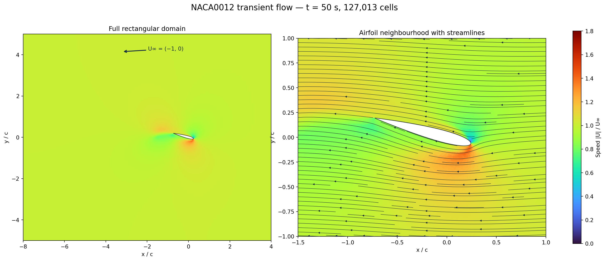

# NACA0012：15°、右向左来流、PISO / k–ω

当前正式配置使用原有 127,013 单元网格、PISO、Wilcox 1988 k–ω、BDF2，
`deltaT=0.01 s`、`endTime=30 s`，4 核并行，共 3000 步。结果每 100 步（1 s）保存一次；
正式计算仍须检查完整日志、保存场和最终场值，短时试算不能替代 3000 步正式结果。
当前网格文件 SHA256 为 `ef58e557a8fee0423e193bc5bcd715aec466c562b435c1cc03f07f267f54fe25`。

## 几何、方向和计算域

- 弦长 `c=1 m`，参考速度 `U∞=1 m/s`，来流 `(-1,0,0)`。
- 翼型前缘朝右，绕四分之一弦点旋转；前缘至尾缘的弦向角为全局 `165°`，
  来流角为 `180°`，两者相差 `15°`。四分之一弦点在原点。
- 矩形计算域 `x/c=[-8,4]`、`y/c=[-5,5]`。前缘到入口约 `3.76c`，
  尾缘到出口约 `7.28c`。这是适中域初始设置，正式升阻力对比仍需扩大域验证边界影响。
- 采用标准 NACA0012 厚度公式的有限厚度尾缘版本（四次项系数 `-0.1015`），
  在最后 `0.0015c` 内用平滑曲线封口，端点仍在 `x_local=1`。
  **它是带微小圆滑尾缘的 NACA0012 近似，不能称为精确复现某个实验尾缘。**
  这种封口避免尖角处法向层退化；与实验比较时必须计入尾缘几何差异。
- 沿 `z` 挤出一层 `0.02c` 厚度，前后均设 symmetry。这是三维有限体积网格上的
  二维约束流动，不包含三维失速机制。

## 网格

Python 显式生成翼面法向四边形层和笛卡尔背景，Triangle 只负责二者间的约束
Delaunay 连接。质量良好的三角形对合并成凸四边形，其余保留；随后统一挤出。
最终文件采用显式面连接的 `BABELSIM_MESH 3` 非结构格式，界面共节点、无悬挂面。

| 项目 | 实际值 |
|---|---:|
| 总单元 | 127,013 |
| 六面体 | 121,567 / 95.712% |
| 三棱柱 | 5,446 / 4.288% |
| 正交笛卡尔背景单元 | 81,920 / 64.50% |
| 翼面周向单元 | 744 |
| 全六面体近壁层 | 48 层 / 35,712 单元 |
| 第一层完整高度 | `3e-5 c` |
| 法向增长率 | 1.12 |
| 法向层总厚度 | `0.05735 c` |
| 实测第一层中心壁距 | `1.50000e-5`～`1.50679e-5 c` |
| 最大 / P95 内部面非正交角 | `38.079° / 3.368°` |
| 近壁层内部最大非正交角 | `2.367°` |
| 背景区内部最大非正交角 | `0°` |
| 最大归一化面偏斜 | `0.48763` |
| 最小平面内角 | `24.835°` |
| 近壁层最小平面内角 | `85.318°` |
| 最大平面边长比 | `142.14`，主要来自刻意设置的薄壁面层 |
| 非正体积 / 凹单元 / 非流形边 | 0 / 0 / 0 |
| 原生读取器最大单元面积向量闭合误差 | `1.46e-16` |

非正交角按体积中心连线与面法向计算；偏斜按面心到中心连线与面平面交点的
距离除以中心间距计算。指标不是“面心到中心连线中点”的误差。
拓扑检查会拒绝不匹配的内界面、漏标的外边界和非流形边。
网格预览为 `mesh/mesh_overview.png` 和 `mesh/mesh_wall_details.png`。

以下为历史配置 `dt=0.5 s` 的旧图，不能作为当前 BDF2 / k–ω 配置成功或精度的证据：



近壁平板摩擦系数估算给出首层中心 `y+≈0.64`，只是设计估算。
分离流实际 `y+` 必须根据求解得到的壁面剪切计算，不能据此宣称全壁面 `y+<1`。

## 求解设置和边界

`rho=1 kg/m³`、`mu=1e-6 Pa·s`，所以 `Re_c=1e6`。k–ω 实现为 **Wilcox1988m**，不是 SST。入口 `k=1.5e-6`、`omega=1.5 s^-1`，对应入口湍流黏度比 `mu_t/mu=1`。壁面 omega 固定值按第一层中心壁距的 Wilcox 光滑壁渐近式计算。该模型没有自动高 y+ 壁函数。

| 边界 | U | p | k / omega |
|---|---|---|---|
| 右侧 inlet | `(-1,0,0)` | 零梯度 | 固定入口值 |
| 左侧 outlet | 零梯度 | `0` | 零梯度 |
| 上下 farfield | `(-1,0,0)` | 零梯度 | 固定入口值 |
| airfoil | 无滑移 | 零梯度 | `k=1e-12`；omega 使用近壁固定值 |
| front/back | symmetry | symmetry | symmetry |

`fields/initial/k.dat` 和 `omega.dat` 用到翼面距离连续建立近壁初始分布。它们是可复现的启动种子，不是已收敛边界层。运行时 `initializePotentialFlow 1` 先修正初始速度和面通量，使初始通量满足连续性，再推进第一个物理时间步。

时间步设置为 `0.01 s`，终止于 `30 s`，共 3000 步。动量使用线性迎风二阶格式；k、omega 使用一阶迎风；时间格式为 BDF2。PISO 每步执行 1 次动量预测和至少 8 次总压力校正，并进行 1 次附加非正交校正。`couplingTolerance=1e-5` 检查压力—速度耦合残差，未达到时增加校正至 `maxCorrectors=50`，仍失败则退出，避免仅凭质量守恒误报成功。速度松弛为 `1.0`；标准分步湍流校正也设为 `1.0`，每个物理步各更新一次 omega 和 k，湍流输运相对残差容限为 `0.05`。压力、动量、k 和 omega 方程均使用 Hypre AMG 预条件。需要把湍流非线性变化也迭代收敛时，可使用 `turbulenceCoupling iterated`，但它每步会多次重解输运方程。

压力、k、omega 和动量方程均配置 PETSc BCGS/CG 与 Hypre AMG 预条件。为避免 BDF2 启动局部负值令 `k/omega` 人为变得极大，Wilcox 实现增加 `maxTurbulentViscosityRatio=1e5`，以 `omega >= rho*k/(1e5*mu)` 限制湍流黏度；日志中的 `omegaBoundedCells` 记录触发单元数。

早期诊断见 `validation/piso-komega-diagnosis.md`；后续确定性发散、对照试验及修复见
[2026-09-28 耦合审计](validation/piso-coupling-audit-20260928.md)。
原 `dt=0.01 s`、3 次 PISO 校正的两次长算都在约 `8.5 s` 发散，不能归因于会话中断。
修复后的 8 次校正已在同一 `t=8 s` 保存场上通过至 `9.5 s` 的定位试算；该试算会重新建立
时间历史，不能替代从 `t=0` 的完整验证。
当前完整重跑的结果目录为 `results/piso_komega_bdf2_dt0p01_T30_mpi4_coupled`，
日志与退出状态在 `validation/piso_audit_20260928/formal/`。`final/` 表示最近一次保存，
并不自动表示达到 `30 s`；应同时核对 `status.json` 和最终元数据的物理时间。

## 生成、复核与运行

在仓库根目录执行。生成器依赖列在 `requirements-mesh.txt`；推荐在独立 Python
环境安装，避免覆盖其他工程的 NumPy。

```bash
python3 -m pip install --target "$HOME/.local/share/babelsim/naca-mesh-python" -r cases/naca0012/requirements-mesh.txt
export PYTHONPATH="$HOME/.local/share/babelsim/naca-mesh-python${PYTHONPATH:+:$PYTHONPATH}"
python3 cases/naca0012/generate_mesh.py
python3 cases/naca0012/plot_mesh.py
python3 cases/naca0012/plot_flow.py --time 50

make -j4
mpic++ -std=c++17 -O2 -Iinclude cases/naca0012/check_mesh.cpp build-petsc/libbabelsim.a -o /tmp/naca-check-mesh
/tmp/naca-check-mesh cases/naca0012/mesh/naca0012.mesh > cases/naca0012/mesh/reader_quality.json

python3 cases/naca0012/run_smoke.py --steps 10 --ranks 4
# 将上一条输出的 run_directory 传给检查器：
python3 cases/naca0012/summarize_run.py /absolute/path/to/run_directory

mpirun -np 4 build-petsc/babelsim-solve -case cases/naca0012
```

当前正式运行配置采用 `deltaT=0.01`，短算脚本也拒绝 `--dt < 0.005`。
短算脚本复制配置到带时间戳的 `results/smoke-*`，引用同一份全尺寸网格，
不修改正式 control.bs。`summarize_run.py` 同时检查退出码、完成步数、线性求解状态、
全局单元覆盖、所有保存时刻的有限性、k/omega 下限截断和宽松启动场值上限。
这些上限只用于拒绝明显失稳，不是物理验证指标。

## 物理验证边界

正式验证需提取升阻力时间历程、Cp、分离位置和壁面 y+，丢弃启动段后统计均值、
振幅与主频，并进行网格、时间步、域大小及入口湍流参数敏感性研究。
15° 的二维 URANS 结果也不能直接代表真实三维失速流动。

参考：
- [NASA/TMBWG Wilcox 模型定义与壁面条件](https://tmbwg.github.io/turbmodels/wilcox.html)
- [NASA/TMBWG NACA0012 验证条件](https://tmbwg.github.io/turbmodels/naca0012_val.html)

NASA 上述基准的 Re 为 `6e6`，域、尾缘和模型条件也不等同于本例。
本例选 `Re=1e6` 是适中计算域的湍流模型试验算例；不能直接拿不同条件的 Cl/Cd
给出模型误差百分比。当前交付没有完成实验数据对比或长期统计。
