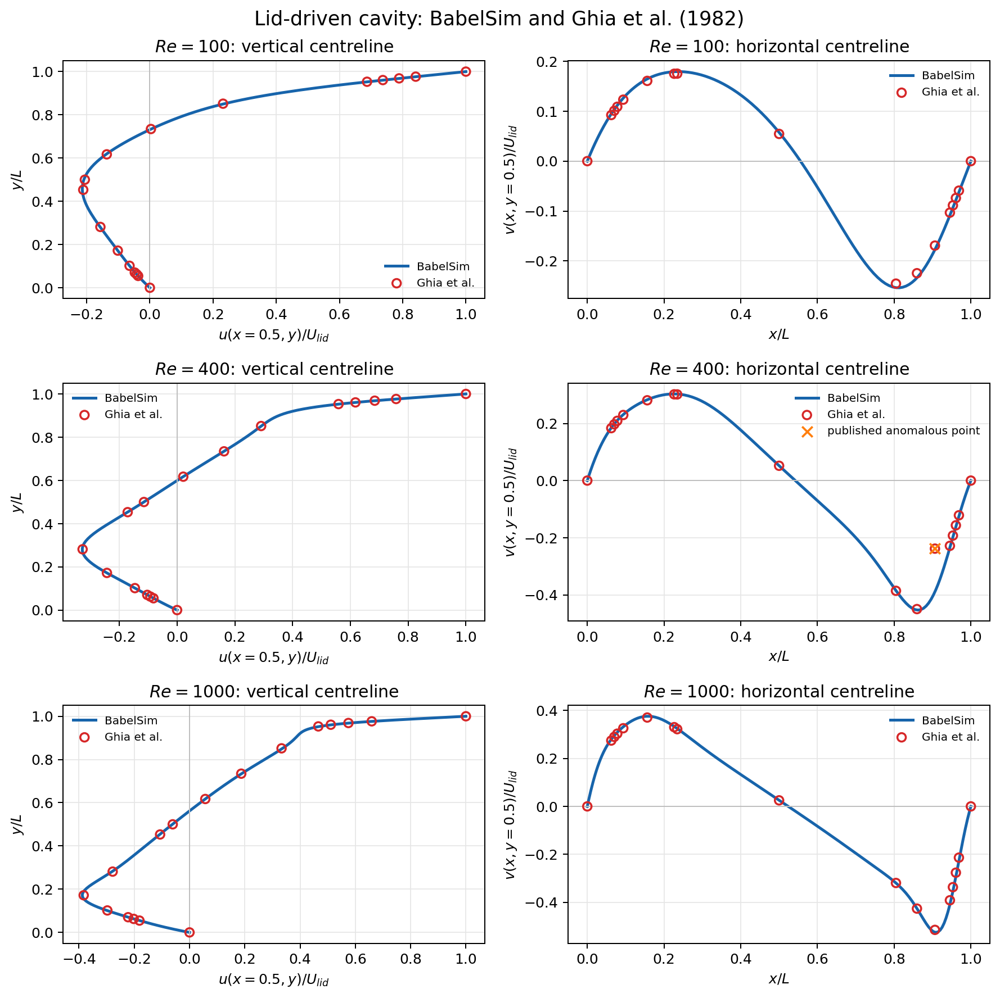
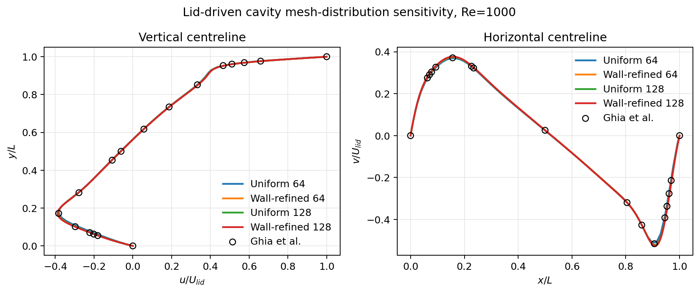
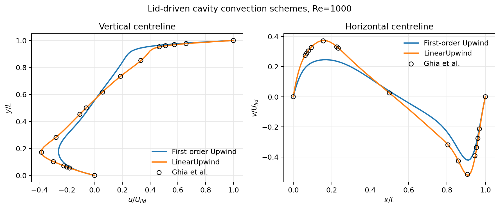
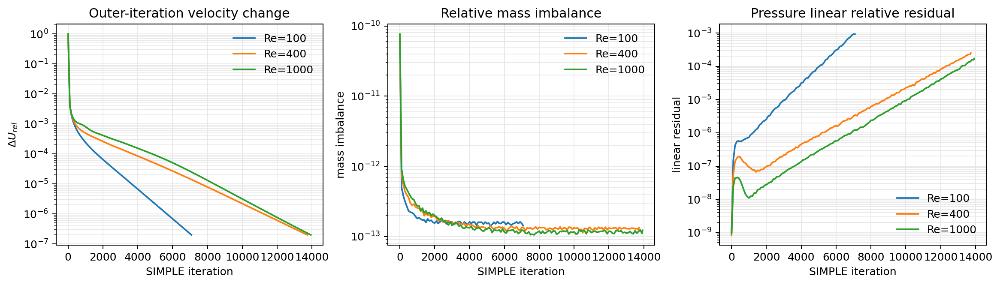
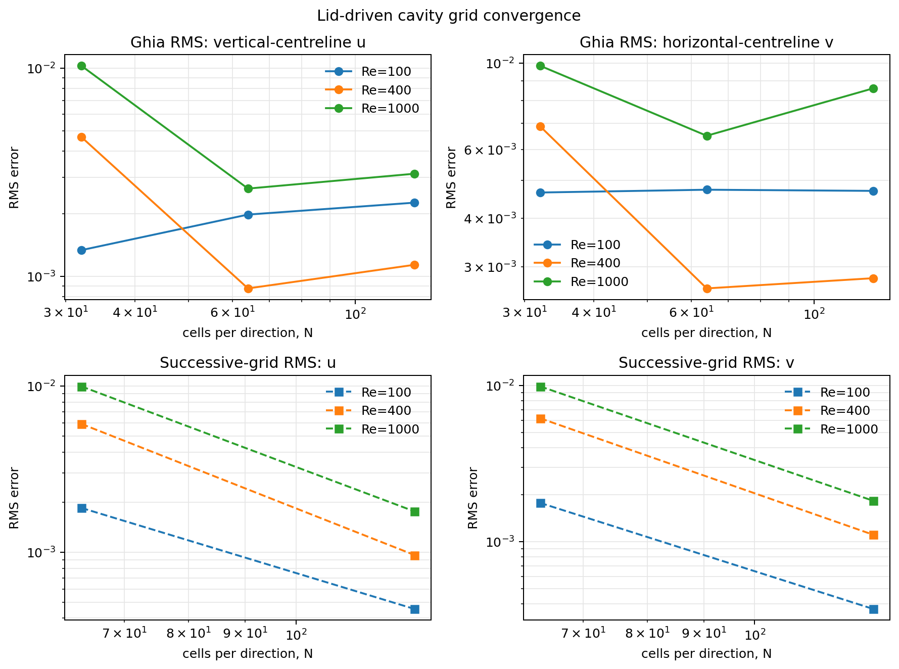
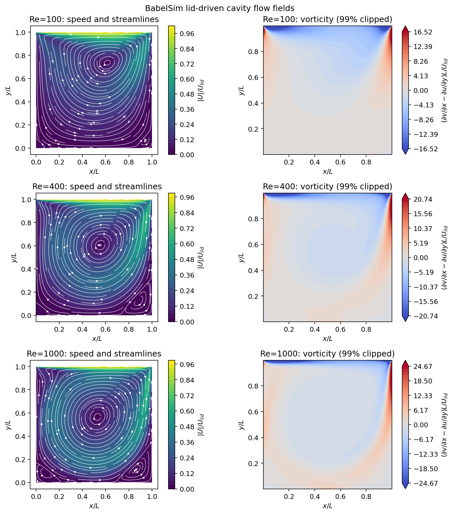

# 二维顶盖驱动方腔 Ghia 验证报告

本报告记录 2026-09-04 使用 BabelSim 稳态不可压 SIMPLE 求解器完成的
Re=100、400、1000 定量验证。所有作为最终结论的流场均达到统一的外迭代速度门限
`2e-7`，并使用 MPI 域分解计算；未收敛中间结果不参与精度结论。

## 1. 参考基准与结论

基准来自 Ghia、Ghia 和 Shin 的经典论文
[High-Re Solutions for Incompressible Flow Using the Navier-Stokes Equations and a Multigrid Method](https://doi.org/10.1016/0021-9991%2882%2990058-4)，
其[原文 PDF](https://www.ljll.fr/~frey/papers/Navier-Stokes/Ghia%20V.%2C%20High-Resolutions%20for%20incompressible%20flow%20using%20the%20Navier-Stokes%20equations%20and%20a%20multi-grid%20method.pdf)
采用二维不可压缩涡量—流函数形式，并给出方腔中心线速度表。NASA 的
[Driven Cavity 验证案例](https://www.grc.nasa.gov/WWW/wind/valid/cavity/cavity.html)
也将该问题作为二维层流不可压缩流的验证基准。

主要结论如下：

- Re=100/400/1000 的 128² 壁面加密结果与 Ghia 中心线曲线一致，两个速度分量的
  Ghia 采样点 RMS 均小于顶盖速度的 1%；
- 从 32²→64² 到 64²→128²，整条中心线的逐级网格 RMS 差异下降 4.1–6.2 倍；
- Re=1000、64² 上，一阶迎风的 `u/v` RMS 为 `6.20e-2/7.31e-2`，二阶
  `linearUpwind` 降为 `2.64e-3/6.51e-3`。原有大误差来自一阶迎风数值耗散；
- 相同案例的串行与 2/4-rank 结果最大绝对差为 `3.63e-9`–`1.98e-8`（U）和
  `1.46e-9`–`1.37e-8`（p），且外迭代次数相同；未发现 MPI 停止行为或 halo 算子不一致；
- 验证支持当前 Re≤1000、稳态层流、二维退化三维路径。它不证明更高 Re、非稳态转捩或
  任意网格上的精度。



## 2. 物理问题、计算域和边界条件

计算域为单位正方形：

\[
(x,y)\in[0,1]\times[0,1],\qquad L=1,
\]

三维网格取 `128 × 128 × 1`，z 方向前后面为 symmetry，所以二维问题通过统一三维
Mesh 自然退化，没有独立二维求解器。密度、顶盖速度和长度均取 1：

\[
\rho=1,\qquad U_{lid}=1,\qquad
Re=\frac{\rho U_{lid}L}{\mu},\qquad \mu=\frac{1}{Re}.
\]

边界逐项检查如下：

| Patch | 速度 U | 压力 p | 数值意义 |
|---|---|---|---|
| `lid` | fixedValue `(1 0 0)` | zeroGradient | 匀速运动顶盖、不可穿透 |
| 左、右、下壁 | fixedValue `(0 0 0)` | zeroGradient | 静止无滑移、不可穿透 |
| `front/back` | symmetry | symmetry | z 方向二维退化 |

压力修正场从 p 的边界自动生成齐次修正边界；闭腔没有固定压力时，由压力方程设置一个
参考值消除常数零空间。顶盖与侧壁交角处的切向速度不连续是标准方腔基准本身的角点奇异性，
不是边界文件遗漏。最终结果的 `max(abs(w))` 为 `5.05e-26`–`1.99e-25`，验证了二维对称退化。

## 3. 网格与壁面加密

壁面加密族使用同一双曲正切映射：

\[
x_i=\frac{1}{2}\left[1+
\frac{\tanh\{\beta(2i/N-1)\}}{\tanh\beta}\right],\qquad \beta=1.5,
\]

y 方向相同。它保持正交性，只改变单元宽度；因此扩散仍使用中心型正交有限体积离散，
不需要虚构非正交修正。

| N | 最小 Δx/L | 最大 Δx/L | 最大/最小 |
|---:|---:|---:|---:|
| 32 | `1.0193e-2` | `5.1636e-2` | 5.07 |
| 64 | `4.8827e-3` | `2.5875e-2` | 5.30 |
| 128 | `2.3898e-3` | `1.2944e-2` | 5.42 |

以 `δ/L≈Re^-1/2` 仅作边界层尺度估计，128² 网格在 Re=100/400/1000 下分别约有
42、21、13 个最小壁面单元跨越该尺度。该估计不是湍流壁面 `y+` 判据。

同时对 Re=1000 计算均匀网格，避免只凭“加密看起来合理”选网格：

| 网格 | N | Ghia u L2 | Ghia v L2 |
|---|---:|---:|---:|
| 均匀 | 64 | `8.716e-3` | `4.242e-3` |
| 壁面加密 | 64 | `2.644e-3` | `6.507e-3` |
| 均匀 | 128 | `3.097e-3` | `5.409e-3` |
| 壁面加密 | 128 | `3.116e-3` | `8.610e-3` |

均匀网格 64→128 的整线差异为 `u=4.988e-3、v=5.614e-3`；壁面加密网格为
`u=1.757e-3、v=1.829e-3`。壁面加密明显改善逐级网格一致性和近壁分辨率，但不会让每个
离散 Ghia 点都单调变好；后者还受 Ghia 有限网格、方法差异和中心线插值影响。因此报告采用
壁面加密族判断网格收敛，同时单独保留均匀网格敏感性结果，不用调网格来追逐单个基准点。



## 4. 离散格式与 SIMPLE 实现审查

最终设置为：

```text
interpolation linear
gradient greenGauss
convection linearUpwind
diffusion orthogonal
time steady
```

除对流项外均使用中心型形式。这里的 `interpolation linear` 是通用的 owner/neighbour
距离加权面插值，用于 U、rAU、梯度等普通单元场；它不代替压力—速度耦合。SIMPLE 内部仍按：

1. 组装并求解 `eqn::div(rho,phi,U) == -math::grad(p) + eqn::laplacian(mu,U)`；
2. 从动量响应得到 `rAU=V/aP`；
3. 通过 Rhie–Chow 型动量插值构造 `phiHbyA`；
4. 求解压力修正方程 `-laplacian(rAU,p') == -div(phiHbyA)`；
5. 修正 p、U 和面通量 phi；
6. 以全局速度变化、连续性、线性收敛和健康状态共同决定停止。

`linearUpwind` 没有改变上述 SIMPLE 专用算法。它属于通用对流 Operator：矩阵保留一阶迎风
隐式基底，迎风单元梯度到真实面中心的二阶重构作为延迟修正进入右端。这样保持对流方向性、
避免复制 LDU 数组，并让 scalar/vector、串行/MPI 使用同一实现。标量和矢量仿射场均有
非正交单元精确性测试；分区交界还用两层 halo 单独验证。

Green–Gauss 与 Least-Squares 在本正交可分离网格的 Re=1000、64² 结果差异低于
`3.27e-8`（同时包含串行/MPI舍入差异），因此采用开销更低的 Green–Gauss。若网格非正交，
仍应按框架既有方法选择 Least-Squares 与 corrected/limitedCorrected diffusion。

### 格式对照

在同一 Re=1000、64²、β=1.5 网格和相同收敛门限下：

| 对流格式 | u L2 | v L2 | 外迭代 |
|---|---:|---:|---:|
| 一阶 Upwind | `6.203e-2` | `7.310e-2` | 3235 |
| 二阶 LinearUpwind | `2.644e-3` | `6.507e-3` | 10223 |

二阶结果分别改善约 23.5 倍和 11.2 倍，代价是更严格地收敛非线性延迟修正需要更多外迭代。
中心对流仅作为排查数值耗散的诊断计算，最终结果按要求全部采用迎风族格式。



## 5. 收敛性与 Ghia 定量结果

外迭代停止条件使用所有 MPI rank 的全局归约值。128² 最终状态为：

| Re | MPI ranks | 外迭代 | 相对速度变化 | 相对质量不平衡 | max abs(w) |
|---:|---:|---:|---:|---:|---:|
| 100 | 4 | 7078 | `1.99993e-7` | `1.42913e-13` | `5.05e-26` |
| 400 | 4 | 13730 | `1.99980e-7` | `1.34498e-13` | `1.50e-25` |
| 1000 | 8 | 13927 | `1.99890e-7` | `1.22876e-13` | `1.99e-25` |

日志中的 `linP` 是线性系统相对其当轮缩小尺度的残差，所以在压力修正源逐渐趋零时可能上升；
线性 Solver 同时检查绝对容差和真实残差，三组最终状态均为 `linear=ok`。它不能替代外迭代
`dU` 与连续性判据。



对每个 Re，先把 cell-centred 结果线性插值到 `x=0.5` 或 `y=0.5`，再插值到 Ghia 的
17 个表格坐标。本文 L2 是这些采样点的 RMS 绝对误差：

\[
E_2=\sqrt{\frac{1}{N}\sum_i(q_i^{BabelSim}-q_i^{Ghia})^2},\qquad
E_\infty=\max_i|q_i^{BabelSim}-q_i^{Ghia}|.
\]

因为 `Ulid=1`，数值也等于相对于顶盖速度的无量纲误差；它不是整个二维域的连续积分范数，
也不是逐点相对误差。Re=400、`x=0.9063` 的原表值 `v=-0.23827` 与相邻点不连续。
后续同行评审工作明确将它视为原文转录错误并从误差计算排除，例如
[Chen 等，Computer Physics Communications 322 (2026) 110081](https://ir.library.osaka-u.ac.jp/repo/ouka/all/104610/ComputPhysCommun_322_110081.pdf)。
本报告在图中保留并标记原值，但不把它计入 Re=400 的 v 范数。

| Re | u(0.5,0.5) | Ghia u | v(0.5,0.5) | Ghia v | u L2 | v L2 | u Linf | v Linf |
|---:|---:|---:|---:|---:|---:|---:|---:|---:|
| 100 | `-0.208871` | `-0.20581` | `0.057501` | `0.05454` | `2.263e-3` | `4.700e-3` | `4.947e-3` | `9.118e-3` |
| 400 | `-0.115049` | `-0.11477` | `0.052114` | `0.05186` | `1.139e-3` | `2.808e-3` | `2.475e-3` | `6.067e-3` |
| 1000 | `-0.061960` | `-0.06080` | `0.025727` | `0.02526` | `3.116e-3` | `8.610e-3` | `5.859e-3` | `1.714e-2` |

## 6. 网格无关性

表中 `grid L2` 在 1001 个公共中心线坐标上比较相邻两级网格，不使用 Ghia 数据：

| Re | N | Ghia u L2 | Ghia v L2 | 相对上一级 grid u L2 | grid v L2 |
|---:|---:|---:|---:|---:|---:|
| 100 | 32 | `1.339e-3` | `4.655e-3` | — | — |
| 100 | 64 | `1.984e-3` | `4.732e-3` | `1.846e-3` | `1.775e-3` |
| 100 | 128 | `2.263e-3` | `4.700e-3` | `4.544e-4` | `3.709e-4` |
| 400 | 32 | `4.676e-3` | `6.881e-3` | — | — |
| 400 | 64 | `8.775e-4` | `2.643e-3` | `5.917e-3` | `6.185e-3` |
| 400 | 128 | `1.139e-3` | `2.808e-3` | `9.597e-4` | `1.108e-3` |
| 1000 | 32 | `1.027e-2` | `9.836e-3` | — | — |
| 1000 | 64 | `2.644e-3` | `6.507e-3` | `9.954e-3` | `9.901e-3` |
| 1000 | 128 | `3.116e-3` | `8.610e-3` | `1.757e-3` | `1.829e-3` |

64→128 的逐级差异比 32→64 分别缩小约 4.1/4.8 倍（Re=100）、6.2/5.6 倍
（Re=400）和 5.7/5.4 倍（Re=1000）。这证明解随网格系统收敛，但最细两级仍有
`3.7e-4`–`1.8e-3` 的整线差异，所以更严谨的表述是“已进入低网格敏感区”，而不是
“误差严格为零的网格无关解”。Ghia 误差在 64→128 不总是单调下降，也不能据此否定
逐级网格收敛：Ghia 表本身是有限网格、不同变量布置和不同离散方法的离散参考，不是解析解。



## 7. 流场结构

随着 Re 增大，主涡中心向方腔中心附近移动，底部角涡逐渐清晰。Re=400 出现明显右下角
次涡，Re=1000 两个底角次涡均可辨认；这与经典方腔流动拓扑一致。速度流线由非均匀 cell
结果仅为绘图重采样到均匀网格，定量误差仍从原始 cell 数据计算。



## 8. MPI 一致性与完整回归

32²/64² 网格使用 2/4 rank 重跑；128² 主结果使用 4/4/8 rank。相同 64² 案例按 global ID
对齐后比较串行与 MPI 输出：

| Re | 对照 | U 最大绝对差 | p 最大绝对差 | 外迭代次数 |
|---:|---|---:|---:|---:|
| 100 | 1 vs 2 rank | `1.825e-8` | `1.373e-8` | 2165 / 2165 |
| 400 | 1 vs 2 rank | `1.984e-8` | `9.449e-9` | 4511 / 4511 |
| 1000 | 1 vs 4 rank | `3.633e-9` | `1.458e-9` | 10223 / 10223 |

进程数改变只造成并行归约顺序带来的合理浮点差异，没有额外外迭代。另执行：

```bash
make test
make test-mpi
make -j2 test-workflow test-external
make test-mpi-poiseuille validate-poiseuille
make validate-cavity
```

普通、MPI、仓库外 Solver、完整工作流、Poiseuille 和 Re=100 方腔回归均通过。
`parallel_domain_test` 还验证 LinearUpwind 在 MPI 分区交界的两层 halo 仿射精确性。

## 9. 复现

下面以 Re=1000、128² 壁面加密、8 rank 为例：

```bash
python3 cases/cavity/validation/generate_cavity_case.py \
    /tmp/cavity-Re1000-N128 \
    --cells 128 --re 1000 --cluster 1.5 \
    --convection linearUpwind --gradient greenGauss \
    --velocity-relaxation 0.25 --max-iterations 30000

TMPDIR=/tmp mpirun -np 8 build/babelsim-solve \
    -case /tmp/cavity-Re1000-N128 -time validation

python3 cases/cavity/validation/validate_cavity.py \
    /tmp/cavity-Re1000-N128/results/validation --re 1000
```

绘图环境若同时安装了系统 Matplotlib 和用户 NumPy 2，可使用
`PYTHONNOUSERSITE=1 /usr/bin/python3` 选择相互兼容的系统 NumPy/Matplotlib；这只影响绘图，
不影响 C++ 求解结果。

## 10. 剩余限制和建议

- 当前 LinearUpwind 是未限制的二阶迎风重构。Re 更高、网格质量较差或强间断输运问题应增加
  有界 limiter，并重新做非正交/MPI 验证；
- Ghia 对照只验证中心线速度，不能替代全场压力、涡量、角涡位置和守恒验证；
- 本次最细网格仍有约 `1.8e-3` 的 Re=1000 整线逐级差异。若目标是发表级精度，应继续到
  256²，并与更高精度 benchmark 交叉比较；
- 不应把一阶迎风“更快收敛”误作更准确。它在 Re=1000 已收敛到明显过度耗散的离散解；数值收敛与
  离散精度是两个独立问题。

## 11. 最终验证结论

在本报告覆盖的范围内，可以得出以下结论：

1. **正确性通过。** Re=100、400、1000 的连续性残差均低于 `1.5e-13`，二维退化方向
   速度低于 `2.0e-25`；中心线速度形状、符号、主涡与角涡拓扑均符合经典方腔流动。
2. **定量精度达到当前验收目标。** 128² 壁面加密网格上，六组 Ghia 中心线 RMS 均低于
   `8.7e-3 Ulid`；Re=100/400 的误差较小，Re=1000 的横向中心线 v 是当前最弱项。
3. **网格收敛得到验证，但不能宣称完全网格无关。** 64²→128² 的整线差异比
   32²→64² 缩小 4.1–6.2 倍，说明已进入低网格敏感区；最细两级仍存在最高约
   `1.83e-3 Ulid` 的整线 RMS 差异。
4. **二阶迎风是必要改进。** 相同 Re=1000、64² 网格上，LinearUpwind 相比一阶迎风将
   Ghia RMS 降低一个数量级以上；代价是外迭代增多，且当前无限制重构不适合直接推广到强间断问题。
5. **MPI 路径一致。** 串行与 2/4-rank 最大场差异保持在 `2e-8` 以下、外迭代次数完全相同；
   结合分区面两层 halo 的算子测试，没有发现本次验证范围内的进程行为分歧。

当前方案的优势是：守恒性好，SIMPLE 压力—速度耦合与通用二阶迎风职责分离，scalar/vector
和 MPI 共享同一算子实现，二维问题使用统一三维框架；在 Re≤1000 的稳态层流方腔上，以适中的
128² 网格即可得到低于 1% 顶盖速度的中心线 RMS。

当前方案的不足是：LinearUpwind 尚无 limiter；Ghia 仅提供稀疏中心线离散参考且含一个已知异常点；
Re=1000 的 v 分量与 Ghia 差异大于其余五组；128² 仍不是严格网格无关解；本验证没有覆盖更高 Re、
瞬态、强非正交网格或三维流动。因此它证明的是“当前算法在指定层流基准范围内正确且有合理精度”，
而不是对所有 CFD 问题的普遍精度保证。

建议按优先级继续：

1. 为 LinearUpwind 增加有界 limiter，并在斜网格、MPI 分区面和强梯度输运上做一致性测试；
2. 计算 256² 网格并结合更高精度方腔数据，量化 Re=1000 的剩余离散误差和表观收敛阶；
3. 增加主涡/角涡中心、涡量极值、全局动量平衡与压力差等独立指标，避免只依赖中心线；
4. 对 SIMPLE 松弛、非线性外迭代和线性容差做性能剖析，在不放松最终物理门限的前提下降低迭代成本；
5. 将同一验证方法扩展到三维方腔和非正交网格，分别验证几何修正与分布式算子。
