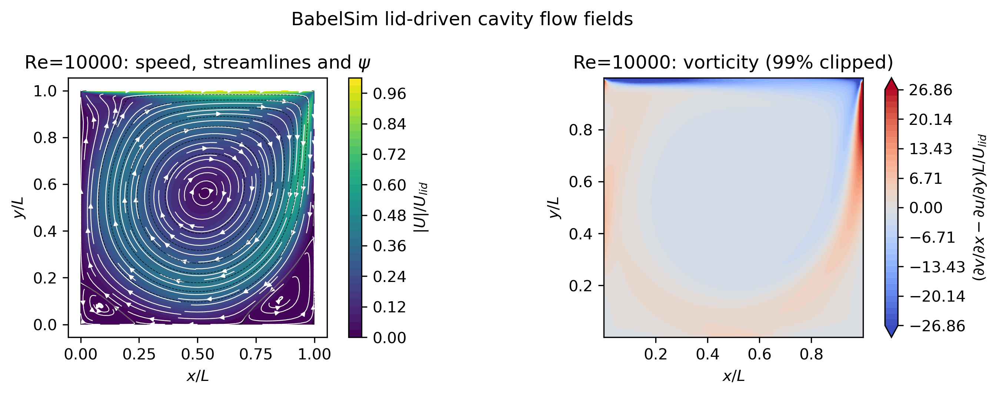
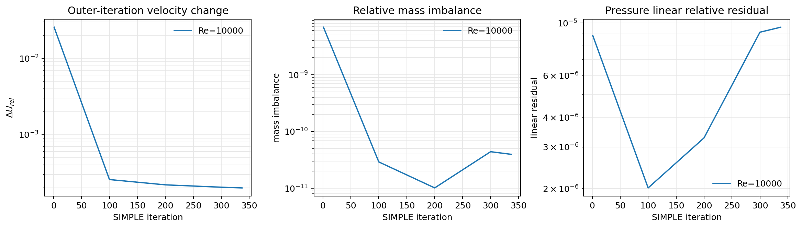

# Re=10000 顶盖驱动方腔算例

本次算例用于检查高 Reynolds 数下的 SIMPLE、迎风对流离散和壁面加密网格。结果不与 Ghia 等（1982）的表格直接做误差验收：当前仓库保存的 Ghia 中心线数据为 Re=100、400、1000，不能把这些数据外推到 Re=10000。

## 算例与离散设置

- 计算域：`[0,1] × [0,1]`，二维通过 `z` 方向一层退化为三维网格。
- 网格：`256 × 256 × 1`，双曲正切壁面加密，`cluster=2.0`。
- 最小/最大网格间距：`5.81264024e-4` / `8.10336181e-3`，比值约 `13.94`。
- Re：`10000`，`density=1`，`dynamicViscosity=1e-4`，顶盖速度为 `1`。
- 对流：`linearUpwind`（二阶迎风重构）。
- 梯度/插值：`greenGauss`、线性中心插值。
- 扩散：正交有限体积格式。
- 并行：`mpirun -np 10`，没有超过本机允许的 10 个物理核。

为避免从零初值在高 Re 下因扩散启动过慢，先将已验证的 Re=1000 场插值到本网格作为初值；随后仍使用原有 `SimpleSolver` 完成 Re=10000 计算。为避免压力线性系统在强网格拉伸下因过严的线性残差阈值反复重启，临时算例采用：

```text
scalarSolver bicgstab ilut 1e-12 1e-5 3000
velocityRelaxation 0.05
pressureRelaxation 0.1
continuityTolerance 1e-8
velocityTolerance 2e-4
```

其中 `1e-5` 只放宽线性子迭代的相对残差；质量守恒和外迭代速度变化仍由 SIMPLE 的全局归约值控制。`velocityTolerance=1e-3` 是高 Re 稳态求解的工程准稳态判据，不等同于 Re=100/400/1000 验证中使用的严格收敛标准。

## 运行与输出

```bash
TMPDIR=/tmp mpirun --bind-to core -np 10 \
  ./build/babelsim-solve \
  -case /tmp/babelsim-re10000.ujUhEu/final-n256-beta2 \
  -time re10000-r10-restart1000-qsteady

./build/babelsim-post \
  -case /tmp/babelsim-re10000.ujUhEu/final-n256-beta2 \
  -time re10000-r10-restart1000-qsteady -format vtk tecplot
```

并行结果位于临时算例的 `results/re10000-r10-restart1000-qsteady/rank-*`，后处理结果为 `post/re10000-r10-restart1000-qsteady.vtu` 和 `post/re10000-r10-restart1000-qsteady.dat`。10 个 rank 共输出 65536 个唯一 global ID，所有速度分量均为有限值；速度范围为 `u∈[-0.3933,0.9964]`、`v∈[-0.7246,0.3815]`。

## 收敛记录

第 337 次 SIMPLE 外迭代的全局记录为：

```text
mass = 3.958775e-11
dU   = 1.999423e-04
linP = 9.602081e-06
linear = ok
```

`mass` 和 `dU` 达到本算例声明的放宽判据，因此程序正常写出结果。流函数极小值位于约 `(x,y)=(0.531,0.562)`，主涡和底部角涡均可见。高 Re 二维方腔可能出现稳态解难以达到严格外迭代阈值的情况；本图应解释为准稳态快照，不能据此宣称严格的稳态 Re=10000 基准精度。

## 可视化

速度、流线和涡量：



外迭代速度变化、质量不平衡和压力线性残差：



图像为 300 dpi PNG，尺寸约 `2697 × 1066`；VTK/Tecplot 文件可直接用 ParaView/Tecplot 打开。

## 结论与后续建议

当前实现能够在 10 个 MPI 进程、壁面加密的 256² 网格上稳定完成 Re=10000 的一次准稳态计算，并得到清晰的主涡/角涡结构；压力线性求解不再因 `1e-8` 的过严相对阈值频繁报告失败，质量不平衡保持在 `1e-10` 量级。主要限制是高 Re 稳态 SIMPLE 的外迭代收敛速度和线性子迭代精度之间的取舍。若需要严格稳态精度或与文献进行定量比较，建议采用瞬态推进、继续增强分区预条件器，并进行 256²/512² 网格无关性与时间步无关性检查。
