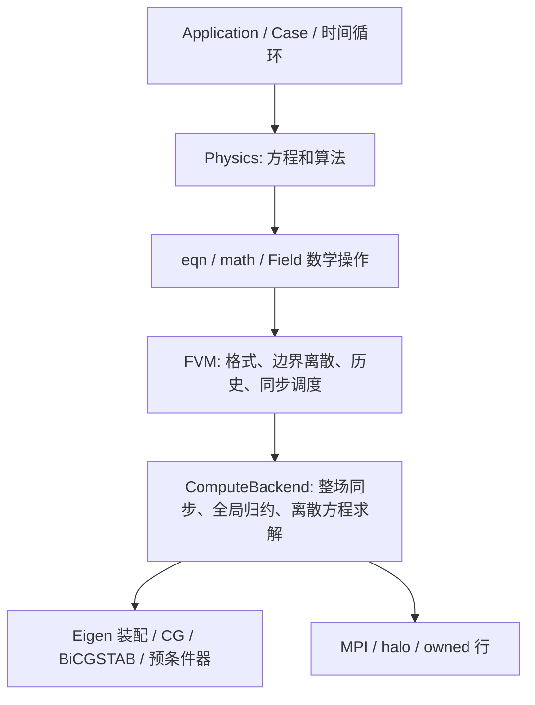

# BabelSim F1–F7 修复、数值验收与开发体验复评

日期：2026-09-09。修复起点为 `e112e597172b7fca5956504c4905e19add13d252`。
本文描述其后的工作区修改；原始 [全代码审查](framework-review-2026-09-09.md) 和反例证据保持不变。
当前源码摘要和本轮日志单独保存在 `f1-f7-evidence`，避免把修复后的运行混进旧基线。

## 1. 结论和软件定位

BabelSim 是面向研究、教学及中小规模 CFD 开发的 C++17 有限体积框架，当前几何范围是
显式非结构六面体网格。它具备可外部开发的方程 API、运行/配置系统、CPU 稀疏求解与 MPI；
已超出单个 SIMPLE 程序，但尚不是经过全面工程验证的多物理平台。

本轮修复的是明确的方程遗漏、边界语义、停止判据、模板深度和结果误配问题。
数值层只增加数学能力；模型、物性以及算法控制仍属于物理层。层流保留原 NS 动量式，
RANS 增加完整偏应力，两个 SIMPLE 使用同一原方程构造计算后更新残差。
正式层流基准仍收敛，湍流新增方程项、时间阶、稳态及并行验收。

不把这些结果扩大为壁流工程验证或集群强扩展验证。k-ε 原论文全文的直接核读、完整
湍流近壁工作流、复杂非定常压力耦合基准仍有限制，见 [模型方程对照](rans-equation-verification.md)。
本轮没有作总体提速承诺：严格残差检查增加工作，部分旧测试需要更准确的内层解。

## 2. 七项发现的修复映射

| 项目 | 最终行为 | 实现位置与独立验收 |
|---|---|---|
| F1 变涡黏度动量缺项 | RANS 为分量 Laplacian 加转置/无迹张量散度；层流为原恒 μ NS | [稳态动量](/home/midway/BabelSim/src/physics/simple/momentum.cpp:17)、[瞬态动量](/home/midway/BabelSim/src/physics/transient_simple/momentum.cpp:20)、[私有应力表达](/home/midway/BabelSim/src/physics/simple_common.h:118)；制造场 U=(2y,0,0)、μe=1+x 得到 (0,2,0) |
| F2 派生边界系数错误 | 未知场保留约束；显式 calculated 模式对单元值/边界迹使用同一数学函数 | [Field](/home/midway/BabelSim/include/babelsim/field.h:241)；非线性点值代数测试和 SA 固定零边界 μe=μ 测试 |
| F3 裁剪掩盖未收敛 | 隐式线性项、更新系数与裁剪后原 PDE 残差；dTurb 和 rTurb 分别检查 | [模型输运及残差](/home/midway/BabelSim/src/physics/RANS/model.cpp:49)；故意裁剪衰减算例 1/2/4 进程必须失败且无成功最终输出 |
| F4 小量纲线性系统假收敛 | 去掉隐藏舍入容差和固定有量纲 breakdown 下限；串行/MPI 按同一真残差合同判断 | [线性合同](/home/midway/BabelSim/include/babelsim/solver_control.h:88)；原一阶反例及 30 组方法/预条件/尺度制造解 |
| F5 复合算子 halo 不足 | 默认与最低层数均为 3，case 可配置更大；派生梯度先同步再计算边界迹 | [case 读取](/home/midway/BabelSim/src/io/case_reader.cpp:53)、[执行校验](/home/midway/BabelSim/src/discretization/fvm_execution.cpp:84)；扭曲网格、非线性场、poisoned halos、3/4 层对照 |
| F6 混合边界对流/扩散不一致 | 装配前统一面通量上下文，入流固定值、出流零梯度；所有相关算子共享解析后的面条件 | [FVM 装配](/home/midway/BabelSim/src/discretization/fvm_execution.cpp:310)；一单元标量 C=.6、向量 (.6,1.2,1.8)，反向通量得到零 |
| F7 旧结果映射到新几何 | 版本 2 保存有序八顶点几何，后处理逐单元核对，拒绝不一致 | [几何写入](/home/midway/BabelSim/src/parallel/parallel_writer.cpp:129)、[读取](/home/midway/BabelSim/src/io/result_reader.cpp:171)、[后处理](/home/midway/BabelSim/src/io/postprocess.cpp:209)；修改等单元数网格坐标后导出必须失败 |

结果版本 1 仍可作独立字段读取，但缺少几何来源，无法直接用于几何导出。新格式只解决
本轮几何误配问题，没有同时实现通用 checkpoint、配置完整快照或原子多分片提交。

## 3. 抽象层级保持情况



| 层级 | 本轮新增职责 | 物理语义边界 |
|---|---|---|
| Field / Tensor3 | 约束与派生迹的显式模式；点值边界代数；张量加减、转置、迹 | 不识别字段名和单位，不识别模型 |
| eqn / math | `Sp(a,F)` 和 `div(TensorField)` | 只有乘法及微分；不自动区分生产/耗散或构造应力 |
| FVM | 通量上下文、边界梯度、原方程残差和三层模板要求 | 不依赖 SIMPLE、RANS、Case、MPI 或 Eigen 代数后端 |
| Algebra / backend | 共用残差尺度、真残差复核及重启；尺度中立的零判断 | 不按压力、温度或湍流变量调整阈值 |
| Physics | 偏应力、模型反应线性化、下限、p* 约定、外迭代收敛 | 全部留在 src/physics 私有目录 |
| IO / Parallel | ghostLayers 配置、几何来源与分片校验 | 保持通用网格/字段含义 |

没有增加公开的 RANS 算法类、专用 MPI 调用或模型名称判断。外部 Solver 继续通过
Case、Field、eqn、math、solve、diagnostics 表达方程。架构依赖检查及仅公开 SDK 构建的
外部求解器验证负责约束这一点；公开表达式和后端的构建期替换关系保持。

边界语义也有明确成本：calculated 字段保存每面迹，通量上下文是快照；输入改变后须
重新求值。梯度边界由输入约束修正，其他微分结果采用相邻单元常值外推，不能承诺任意
复合高阶导数的边界精度。详见 [数学 API 合同](../eqn-math.md)。

## 4. 收敛和预条件器验收

线性系统统一按全局 owned 行的未预条件真残差判断：

\[
\|b-Ax\|_2\le\max(atol,rtol\max(\|b-Ax_0\|_2,\|b\|_2)).
\]

初始两范数全零时归一化尺度取 1，残差本来即零。舍入停滞不能自行放宽阈值；非有限
范数不返回成功。递推残差与真残差偏离时，剩余预算可用于重启。小尺度系统的非零内积
不会仅因小于固定的 1e-30 而被判 breakdown。测试覆盖 1e-40 至 1e40，不承诺任意
双精度指数范围；平方和范数的极端上溢/下溢仍是明确限制。

原 PDE 残差是重新装配后的 `||Ax-b||/(||Ax||+||b||)`，不含欠松弛和参考点惩罚；
时间历史不会被诊断推进。它的归一化用途不同于线性初始残差，但都不使用隐藏绝对下限。
SIMPLE 必须同时满足线性成功、连续性、dU、dP、rU，RANS 还需 dTurb 和 rTurb。

| 线性方法 | 受测预条件器 | 系统和尺度 |
|---|---|---|
| CG | none、IncompleteCholesky、AMG | SPD 制造扩散，5 个尺度 |
| BiCGSTAB | none、ILUT、AMG | 非对称制造对流扩散，5 个尺度 |

合计每次 30 个组合；默认串行、2 进程三层、4 进程四层均检查解的误差和原方程残差。
这些测试验证预条件器作为求解组成部分的有效性，不能证明任意矩阵都有稳定迭代数。
MPI IC/ILUT 为 rank 局部块分解；不会等于串行因子分解，也不要求迭代次数逐位相同。

串行 AMG 保留聚合、PᵀAP、Jacobi 平滑和 V-cycle；MPI AMG 保留分布式细层加全局聚合
粗层校正。它们是实际 AMG 预条件器，不是独立 AMG solver。MPI 粗矩阵/粗解仍复制于
各 rank，最多 2048 行，不是完整的可扩展分布式多层 AMG。本轮去掉其固定对角尺度
阈值，没有通过改变物理方程改善代数行为。

旧 parallel_channel_test 使用 1e-7 的内层动量相对容差，原方程残差停在 1.96049e-6，
即使 mass=2.38647e-15、dU=6.88571e-9 也不能判成功。将该测试内层容差收紧至 1e-9
后，在 1149 外迭代达到原有 1e-6 动量门槛。这是提高实际内层精度，没有放松外层判据。
旧完整 Poiseuille case 则继续使用原配置，严格判据使其迭代至 1155 步。

## 5. 数值与物理证据

受测算子包括梯度、插值、重构、向量/张量散度、对流、扩散、法向梯度及通量组合。
并行测试将 ghost 值主动污染，使用非仿射三维扭曲网格和非线性标量场；23 个操作 ×
2 种梯度 × 3 种扩散格式，三层 1/2/4 进程及四层 4 进程的最大串行差异为 0。
这是这些确定输入上的比较结果，不承诺所有问题逐位可复现。

湍流模型实际方程、常数及公开来源见 [专门对照报告](rans-equation-verification.md)。
每个模型分别通过非零剪切源项及系数测试；Euler/BDF2 完整 transientSimple 均匀衰减
使用独立解析/RK4 基准。时间步减半误差比的两次观测如下（理想一阶为 2，二阶为 4）：

| 模型 | 时间格式 | dt=.01 最大误差 | dt=.005 最大误差 | dt=.0025 最大误差 | 两次误差比 |
|---|---|---:|---:|---:|---|
| SA | euler | 0.0040543689 | 0.0020739464 | 0.0010491726 | 1.95491 / 1.97674 |
| SA | bdf2 | 0.00037641723 | 9.0959091e-05 | 2.2575814e-05 | 4.13831 / 4.02905 |
| kOmega | euler | 7.2726667e-06 | 3.6407824e-06 | 1.8235648e-06 | 1.99756 / 1.99652 |
| kOmega | bdf2 | 1.0886228e-06 | 2.7631052e-07 | 7.255277e-08 | 3.93985 / 3.80841 |
| kEpsilon | euler | 0.0019209662 | 0.00096913514 | 0.00048676734 | 1.98214 / 1.99096 |
| kEpsilon | bdf2 | 0.00026043173 | 6.4395229e-05 | 1.6018437e-05 | 4.04427 / 4.02007 |

另外执行四模型选择的稳态 1/2/4 进程计算、瞬态 dt=.005 的 1/2/4 进程比较，以及
裁剪导致假收敛的拒绝测试。稳态反应扩散边值问题不是湍流通道实验；均匀衰减也不验证
强压力耦合的 URANS 时间精度。已有的一单元 NS 时间离散反例另作原样重跑。

| 正式层流基准 | 终端收敛 | 精度 |
|---|---|---|
| 方腔 Re=100、64×64、4 进程 | 2908 外迭代，mass=1.350446e-14，rU=7.385606e-7 | Ghia u/v 中心线 L∞=0.0041522014 / 0.0085114402；L2=0.0017992678 / 0.0044043179 |
| Poiseuille、原 case、串行 | 1155 外迭代，mass=2.572570e-15，rU=9.906259e-7 | 出口峰值 1.49895304，L∞=0.00074083677，L2=0.00040245957 |

方腔误差保持审查基线水平。Poiseuille 旧基线在较早迭代停止，L∞ 约 8.54e-4；
新值是在更严格原动量残差下取得，不能把未收敛轨迹混作最终精度。

## 6. 三类开发者的复评

| 视角 | 当前是否容易 | 本轮改善 | 仍需改善 |
|---|---|---|---|
| 框架维护者 | 层级清晰，维护有真实边界测试；复杂度集中在 FVM/算子大文件 | 边界解析集中；数学与物理分开；线性成功合同共享；反例进入回归 | 标量/向量装配仍重复，算子模板深度应更显式；派生迹、halo 有效性和结果版本需要持续维护 |
| 物理 solver 开发者 | 对已有标量/矢量对流扩散及反应方程，开发较敏捷 | `Sp`、张量散度、点值边界代数、原方程诊断可直接复用；RANS 无需存储/MPI API | 复杂块耦合、各向异性张量扩散、多个运行域仍需通用能力扩展；还没有量纲类型和通用非线性求解器 |
| 求解器使用者 | 已有 case 的选择、运行、MPI、输出较直接；专业物理设置仍要求经验 | 默认三层且错误配置早拒绝；日志区分 rU/rTurb 与变化量；网格结果误配会报错 | 需要成套 RANS case、壁距/近壁方案、残差解释、模型适用范围及收敛诊断工具 |

对“能否敏捷开发新物理方程”的判断是：在现有空间/变量类型内可以。新增反应输运通常
只需声明场、读取同一 physics 字典、写 `ddt + div + Sp == laplacian + source`、调用
solve 并定义物理停止规则。新增压力速度耦合算法仍需要私有步骤和状态；这属于算法本身
的复杂性。需要新张量耦合/网格类型时，应先补数学/几何能力及独立测试。

不能把所有困难归结为 API 不够多。本轮特意让数学层不知道变量物理含义：系数的
正负拆分由模型决定，边界按值函数传播，残差按方程计算，halo 按模板需求设置。
这使其他物理开发者获得同样能力，也避免以新增模型为理由持续扩大公共核心。

## 7. 后续改善顺序与不破坏层次的性能路线

1. **验证资产**：物理层补 SA 平板、k-ω/高 Re k-ε 合法近壁通道、非定常压力耦合基准，
   同时保存参考资料、网格/时间细化和终端收敛。墙面摩阻不能由现有均匀衰减代替。
2. **通用数值工作区**：缓存表达式装配模式，复用原方程残差和张量分量重构数组；
   合并同一数学依赖的同步/归约。要求格式、边界和真残差合同不变，不写 RANS 专用捷径。
3. **通用预条件与规模**：增加系数跳变、各向异性及网格细化迭代数测试；按数学矩阵特征
   改进聚合/插值及平滑；真正分布粗层并减少全局网格启动内存。保留矩阵与物理意义隔离。
4. **维护结构**：按算子/值类型组织共享装配，明确 stencil 依赖和导数边界近似；区分
   普通 Solver SDK 与维护头。以外部 SDK 测试约束迁移，避免增加重复接口/兼容壳。
5. **用户证据**：结果中记录配置/源码版本、终止原因及写入完成状态；增加高残差、持续
   裁剪和不适当内层精度的解释。模型/壁距建议放在 Physics/Case 文档，不下沉到代数层。

这些是后续改进建议，本轮没有将未做的性能、壁函数、restart 或集群能力写成已完成功能。

## 8. 可复现命令和证据索引

```bash
make -j4 test test-workflow test-external test-mpi test-rans test-mpi-poiseuille
make -j2 validate-cavity validate-poiseuille
```

第一条覆盖架构边界、普通单元测试、独立外部 Solver、串并行工作流、后处理、数学反例、
模型验收及 Poiseuille 1/2/4 进程结果比较。每项必须实际完成，不以启动或日志中单个
`passed` 代表整条命令成功。RANS 脚本保留所有生成 case、输出和每次运行日志，并打印
临时证据目录；仓库另归档精简日志与 summary.json。

最终验收完成：

| 命令/项目 | 终端状态 | 证据 |
|---|---|---|
| 完整 test + workflow + external + MPI + RANS + MPI-Poiseuille | 退出 0 | [acceptance.log](f1-f7-evidence/acceptance.log) |
| validate-cavity + validate-poiseuille | 退出 0，两者终端收敛 | [physical-validation.log](f1-f7-evidence/physical-validation.log) |
| 最后补充的向量 Sp/残差测试，1/2/4 进程 | 均退出 0 | [串行](f1-f7-evidence/numerical-contract-1.log)、[2 进程](f1-f7-evidence/numerical-contract-2.log)、[4 进程](f1-f7-evidence/numerical-contract-4.log) |
| 原 F4 一阶探针原样重跑 | CG/BiCGSTAB 均 1 步、x=1、真残差 0 | [fixed-scale.log](f1-f7-evidence/fixed-scale.log) |
| 原 F6 探针原样重跑 | 两种边界均为 C=.6 | [fixed-inletoutlet.log](f1-f7-evidence/fixed-inletoutlet.log) |
| 原瞬态 NS 探针原样重跑 | Euler/BDF2 三步离散 ODE 误差 8.94e-12 / 6.76e-12 | [fixed-transient.log](f1-f7-evidence/fixed-transient.log) |
| 模型原始运行与汇总 | 系数、阶数、稳态和预期失败检查均通过 | [summary](f1-f7-evidence/rans-summary.json)、[日志目录](f1-f7-evidence/rans-logs) |

Poiseuille 与串行的最大差：2 进程 U=6.1548582e-7、p=1.543376e-6；
4 进程 U=5.6890165e-7、p=1.6263336e-6，均满足原比较阈值。
裁剪拒绝算例虽然 dTurb=0、linear=ok，rTurb=0.4897959，最终保持未收敛并退出 2。
日志中的溢出范数、预期失败和 mpirun 非零诊断是负向测试的一部分；完整脚本本身退出 0。

完整测试后只补充测试断言和文档，没有再修改生产源码；新增向量 Sp 断言已单独执行
1/2/4 进程。`git diff --check` 通过。源码/测试/case 摘要见
[source-sha256.txt](f1-f7-evidence/source-sha256.txt)，命令状态见
[status.json](f1-f7-evidence/status.json)。修改保留在工作区，未提交、未推送。
